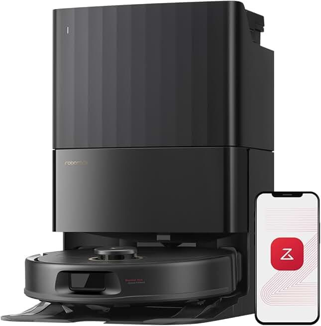
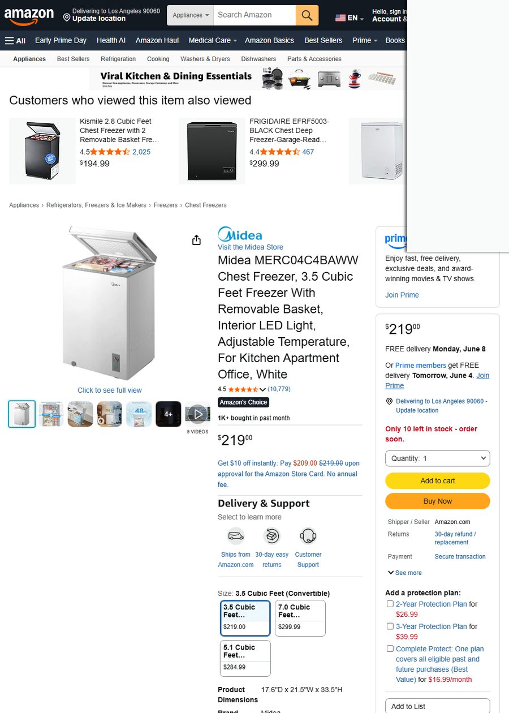
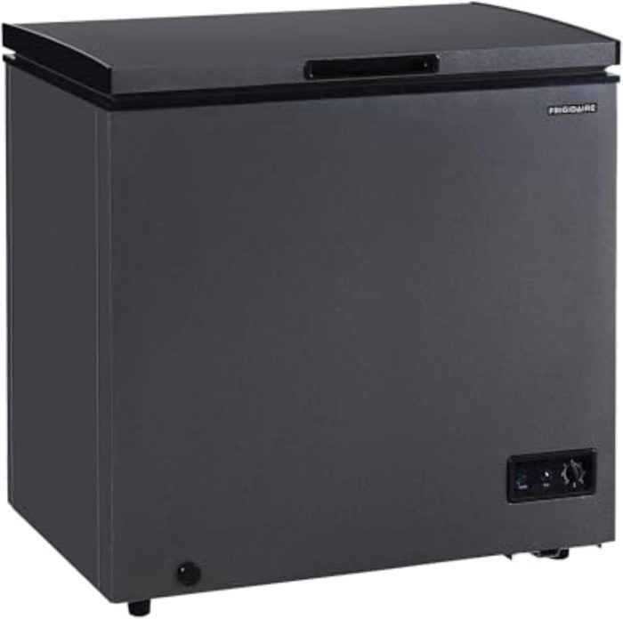
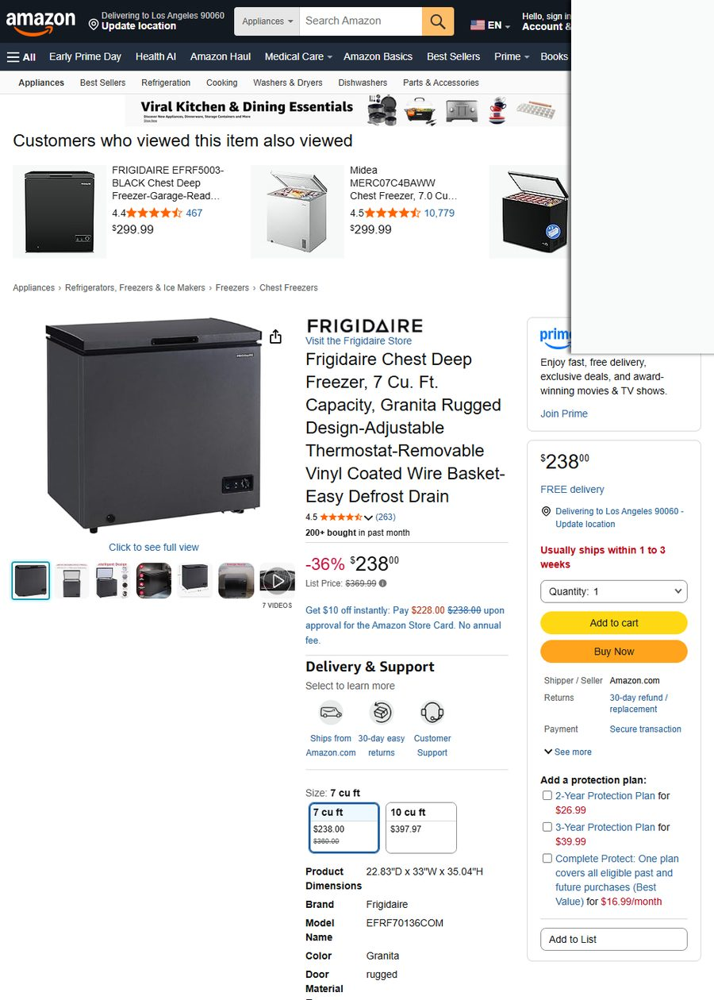
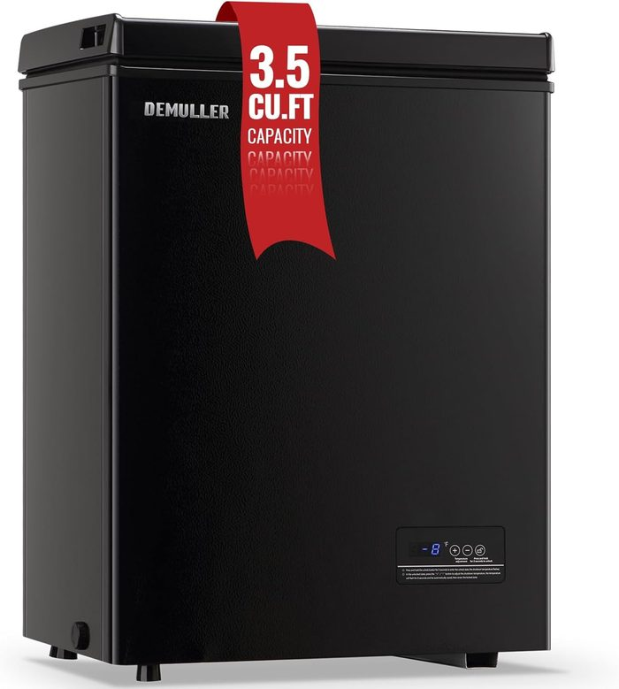

# 📌 选品决策 · 一页速览

> 生成于报告系统 · 数据全部实时抓取、可溯源

## 🎯 决策速览

> 30 秒看懂：做不做、主推什么、能赚多少、风险多大。

| 决策维度 | 结论 |
|:--|:--|
| 🎯 **是否进入** | **🔴 暂不建议（未找到可盈利方案）** |
| 💲 健康期售价 | $159 |
| 📊 市场规模 | $978,956 |

## 🏆 主推方案详情

### 5.1 候选品决策表

| # | ASIN | 商品 | 售价 | 评分 | 容量 | 真实月销 | 评论数 |
|---|------|------|------|------|------|----------|--------|
| 1 | B0CQT26VCW | Midea 7.0 CuFt Chest Freezer | $299.99 | ★4.5 | 7.0 | **1000+** | 10,779 |
| 2 | B0CQT1JGQQ | Midea 3.5 CuFt Chest Freezer | $219.00 | ★4.5 | 3.5 | **1000+** | 10,779 |
| 3 | B0D4TTPY87 | Frigidaire 7 CuFt Chest Freezer | $238.00 | ★4.5 | 7.0 | 200+ | 263 |
| 4 | B0C6LWVGZX | DEMULLER 3.5 CuFt Chest Freezer | $169.99 | ★4.5 | 3.5 | 300+ | 463 |
| 5 | B0D4295KP1 | BLACK+DECKER 2.0 CuFt Compact | $186.86 | ★4.6 | 2.0 | 300+ | 437 |

---

### 候选品 1：Midea 7.0 CuFt Chest Freezer（$299.99 · ★4.5 · 月销1000+）

**对标理由**：冰柜品类绝对销量冠军（月销1000+），7立方英尺容量是美国家庭车库冰柜的黄金尺寸。Midea品牌在Amazon冰柜类目统治力极强，评论数破万说明长期稳定走量。

*（Midea MERC07C4BAWW 主图，来源：Amazon US）*

*（Amazon 详情页截图，2026-06-03）*

---

### 候选品 2：Midea 3.5 CuFt Chest Freezer（$219.00 · ★4.5 · 月销1000+）

**对标理由**：与 #1 并列销量冠军，但容量减半价格降低$80，覆盖小公寓/单身人群。评论数同破万。$219处于价格带最密集区（中位价）。

> 注：主图未成功捕获，以ASIN池缩略图代换。

*（Amazon 详情页截图，2026-06-03）*

---

### 候选品 3：Frigidaire 7 CuFt Chest Freezer（$238.00 · ★4.5 · 月销200+）

**对标理由**：Frigidaire作为美国家电老牌，品牌信任度高于Midea。$238定价比同容量Midea($299.99)低$62，性价比优势明显。"Granita Rugged Design"标题定位差异化——强调坚固耐用户外/车库环境。

*（Frigidaire 7CuFt 主图，Granita Rugged Design，来源：Amazon US）*

*（Amazon 详情页截图，2026-06-03）*

---

### 候选品 4：DEMULLER 3.5 CuFt Chest Freezer（$169.99 · ★4.5 · 月销300+）

**对标理由**：带**数字温度显示面板**（Temperature Display Panel）的差异化低价位产品——恰好命中"温度控制模糊"痛点。$169.99是5个候选品中最低价，走性价比路线。价格带偏低竞争相对少。

*（DEMULLER 3.5Cu

---

> 📂 完整分析（趋势 / 竞品 / 痛点 / 利润 / IP）见商家版报告或完整版。
