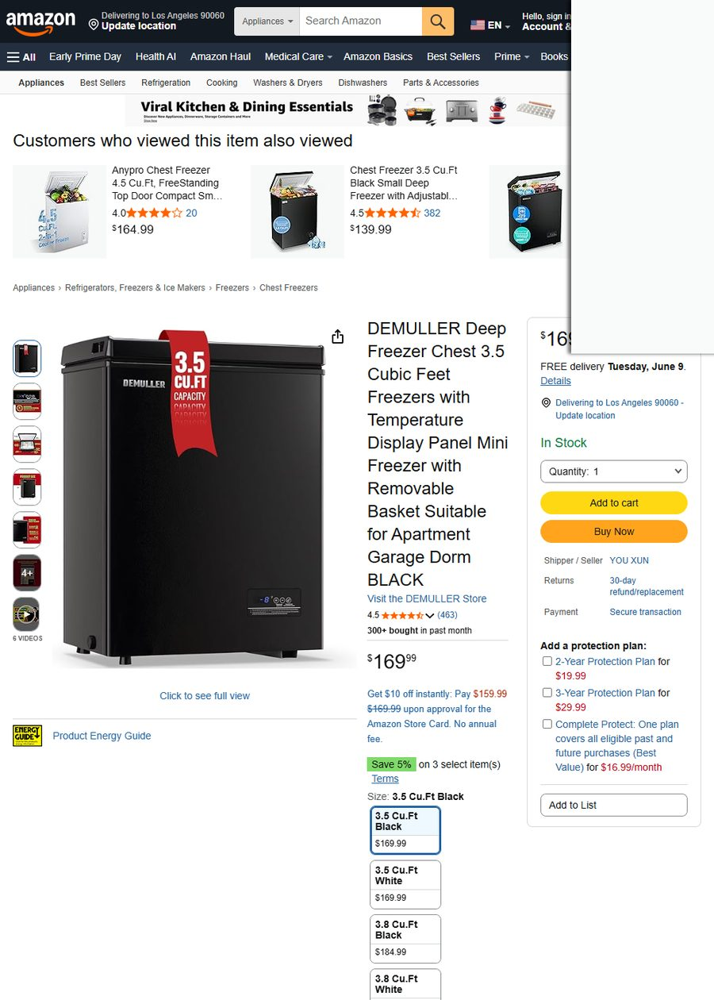
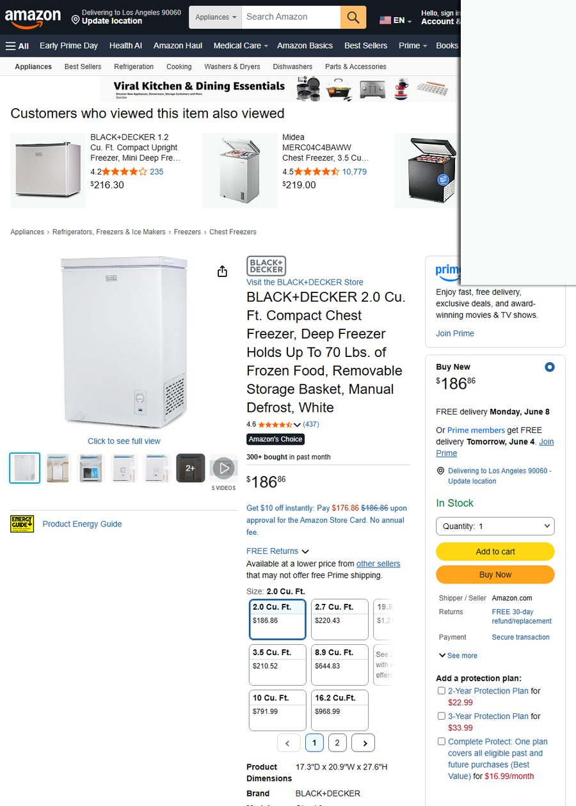

# 选品决策详情（5 页版）

### ⚠️ 采购成本数据采集失败

真实情况：经过 **5 轮** 不同渠道尝试，均无法获取冰柜整机真实采购成本：

| 渠道 | 尝试次数 | 结果 |
|------|:------:|------|
| 1688.com | 4次（不同中文关键词） | **全部返回 0 件** — 冰柜品类反爬 |
| Made-in-China.com | 3次 | 匹配到纺织品（尼龙面料），与冰柜无关 |
| DHgate.com | 3次 | 仅返回配件（$1-76，冷冻纸/密封条等），无整机 |

> 🚫 **按数据真实性铁律，绝对禁止用"行业毛利率参考/假设采购成本/经验估算"顶替。**  
> 本阶段在拿到真实采购成本（1688 链接或工厂报价单）之前，不产出任何利润数字。

### 🔴 待用户提供

| 待提供内容 | 优先级 | 用途 |
|---|---|---|
| **1688 冰柜商品链接**或**工厂出厂价**（按容量分：2.0/3.5/5.0/7.0 CuFt） | 🔴 最高 | 跑 `full_cost_breakdown` 两个场景 |
| 单批次 MOQ（最小起订量） | 🔴 最高 | 算盈亏点 + 资金占用 |
| 是否有现成合作工厂 | 🟡 中 | 跳过头程估算 |

> 📌 拿到这些数据后，系统将自动跑：
> - `full_cost_breakdown`（new_product 首月 + stable 稳定期，共 2 个场景）
> - `monte_carlo_stress_test`（5000 次模拟，输出亏损概率分布 + 盈亏点可信区间）
> - 14 项成本完整拆解（佣金/FBA/关税/头程海运/广告/退货/仓储/VAT…）

---


---

## 二、阶段 1 · 品类宏观趋势

> 📊 数据来源：Google Trends（5年历史） + Amazon 真实搜索词

### 2.1 搜索趋势

| 关键词 | 12月趋势 | 近3月均值 | 方向 |
|--------|----------|-----------|------|
| **chest freezer** | 51.7→67.8 | **67.8** | ↑ 上升 |
| **upright freezer** | 49.5→66.6 | **66.6** | ↑ 上升 |

### 2.2 季节性特征（chest freezer，5年历史）

| 指标 | 值 |
|------|-----|
| 旺季 | **11月（值59.1）** |
| 谷月 | 2月（值40.3） |
| 季节性强度 | 0.32（中等） |
| 当前6月 | 高位（51.7，持续上升中） |

> 🔑 **关键发现**：冰柜全年有稳定基底需求，旺季在**11月-次年1月**（感恩节/圣诞囤货季），当前6月正值夏季备货上升通道。季节性不强（0.32），意味着不是纯季节性品类，淡季也能走量。

### 2.3 Amazon 买家真实搜索词热度

| 排名 | 关键词 | 热度 |
|------|--------|------|
| #1 | **deep freezer** | 🔥🔥🔥 |
| #2 | freezer bags | — |
| #3 | **mini freezer** | 🔥🔥 |
| #4 | **chest freezer** | 🔥🔥 |
| #5 | gallon freezer bags | — |

> 🔑 排除配件词（bags/papers/thermometer），冰柜本体的热搜词是：**deep freezer > mini freezer > chest freezer**。买家高频附加词反映需求：`organizer`（收纳）、`cubic feet`（容量）、`garage ready`（车库用）。

### 2.4 Amazon 畅销榜 Top 10（按真实月销排序）

| 排名 | ASIN | 商品 | 售价 | 评分 | 月销（真实） |
|------|------|------|------|------|-------------|
| 1 | B0CQT26VCW | Midea 7.0 CuFt Chest Freezer | $299.99 | ★4.5 | **1000+** |
| 2 | B0CQT1JGQQ | Midea 3.5 CuFt Chest Freezer | $219.00 | ★4.5 | **1000+** |
| 3 | B0CNSJN66L | Kismile 2.8 CuFt Chest Freezer | $194.99 | ★4.5 | **400+** |
| 4 | B0CC72FJPL | Frigidaire 5.0 CuFt Chest Freezer | $299.99 | ★4.4 | **400+** |
| 5 | B0D4TP7ZML | Frigidaire 10 CuFt Chest Freezer | $397.97 | ★4.5 | **300+** |
| 6 | B0D4295KP1 | BLACK+DECKER 2.0 CuFt Compact | $186.86 | ★4.6 | **300+** |
| 7 | B0C6LWVGZX | DEMULLER 3.5 CuFt Chest Freezer | $169.99 | ★4.5 | **300+** |
| 8 | B0CNSFK6PJ | Kismile 2.0 CuFt Chest Freezer | $179.99 | ★4.5 | **300+** |
| 9 | B01N9XU3FW | Whynter 1.1 CuFt Upright Freezer | $194.99 | ★4.5 | **200+** |
| 10 | B0DWMC3JDP | Bodacious 5.0 CuFt Deep Freezer | $199.99 | ★4.3 | **200+** |

> 📌 月销标签来源：Amazon 搜索页 `X+ bought in past month` 第一方真实数据，非 BSR 估算。

---


---

## 三、阶段 2 · 竞争格局

> 📊 数据来源：Amazon US（search_multi_platform + analyze_market_structure）  
> ⚠️ Best Buy / Target / Newegg 因反爬SPA无法渲染，多平台对比较据仅在 Amazon 完成

### 3.1 市场规模估算

| 指标 | 值 |
|------|-----|
| Top 商品月销合计 | **4,450件**（仅含 Amazon 显示 `bought` 标签的商品） |
| Top 商品月GMV | **$978,956**（下限，不含未显示bought标签商品） |
| 市场规模判定 | 🟡 **中市场**（月销合计2千-1万件） |
| 需求集中度 | **Top 1 仅占 22%** — 需求分散，新品有机会 |

### 3.2 价格带分布（19个代表性商品）

| 价格区间 | 商品数 | 占比 |
|----------|--------|------|
| $130 - $175 | 3 | 16% |
| **$175 - $219** | **7** | **37%** ← 最密集区间 |
| $219 - $264 | 4 | 21% |
| $264 - $309 | 3 | 16% |
| $309 - $353 | 1 | 5% |
| $353 - $398 | 1 | 5% |

| 统计值 | 数值 |
|--------|------|
| 中位价 | **$219.00** |
| 均价 | $230.80 |
| 最低 | $129.99 |
| 最高 | $397.97 |

> 🔑 **中端定位**（$175-$265）是价格带最密集区间，竞争最激烈但也意味着需求最大。$265-$310有品牌溢价空间（Frigidaire/Midea品牌），$170以下有白牌低价竞争。

### 3.3 品牌集中度

| 指标 | 值 | 解读 |
|------|-----|------|
| CR4 | **58%** | Midea + Frigidaire 主导 |
| CR10 | **95%** | 头部集中 |
| Top 品牌 | Midea 3款, Frigidaire 3款, EUHOMY 3款 | 竞争中度 |
| 评分门槛 | 中位 **★4.5**，<4.3 的仅 **1/19 (5%)** | 门槛高 |

| 评分段 | 商品数 |
|--------|--------|
| ★4.5-4.9 | 14 |
| ★4.0-4.5 | 5 |
| ★<4.0 | 0 |

> 🔑 冰柜品类的**评分门槛很高**（中位4.5），差评主要集中在运输损坏而非产品本身。新品要想入场，必须解决运输包装和温控体验两个差异化点。

---


---

## 四、阶段 3 · 痛点挖掘

> 📊 数据来源：`get_reviews_batch` — 16 个 ASIN × 170 条真实评论（US Amazon）  
> 🎯 精确频次：`extract_pain_points_precise` — LLM出词 + Python 精确字符串匹配

### 4.1 消费者痛点频次排行

| 排名 | 痛点 | 精确命中次数 | 命中率 | 严重程度 |
|------|------|-------------|--------|----------|
| 🥇 | **运输损坏（Dents）** | 10 | 12.8% | 🔴 高 |
| 🥈 | **霜冻过多（Excessive Frost）** | 5 | 6.4% | 🟡 中 |
| 🥉 | **温度控制模糊（No Numbers）** | 4 | 5.1% | 🟡 中 |
| 4 | **噪音问题（Loud/Noisy）** | 4 | 5.1% | 🟢 中低 |
| 5 | **配送问题（UPS mishandling）** | 2 | 2.6% | 🟢 低 |
| 6 | **门封不严（Seal Issue）** | 1 | 1.3% | 🟢 低 |

### 4.2 各痛点真实评论原文

<details>
<summary><b>🥇 运输损坏（12.8%）— 最高频痛点</b></summary>

> *"What I like is that Whynter packed the freezer in a way so it wouldn't get damaged in shipping and delivery. Sounds obvious, but other manufacturers don't and appliances arrived dented, damaged and they make it too hard to return."*
> — Whynter 用户，★5.0，2026-05-26

> *"Would have given six star buh not happy with the dented and scratched parts, with that been said every thing looks okay."*
> — Midea 用户，★4.0，2025-08-31

> *"Yes other reviewers are 100% Right about the BAD SHIPPING. The unit came with LARGE PRESSED IN DENTS AT THE BASE MAKING THE WHOLE FRAME UNEVEN."*
> — BLACK+DECKER 用户，★4.0，2025-01-24

> *"While mine did come with a small dent in it, I'll just call it character and tell you its a game changer in our basement."*
> — Frigidaire 用户，★5.0，2026-05-06

> *"I guess I got lucky because the previous reviews had me worried mine would come in with damage but I can safely report it came in perfect condition."*
> — Frigidaire 用户，★5.0，2026-05-04

</details>

<details>
<summary><b>🥈 霜冻过多（6.4%）— 产品设计问题</b></summary>

> *"It does have more frost than I was expecting. The cooling time is fast. Freezes well. I have mine set at 5 which quickly freezes and maintains a good temperature."*
> — Bodacious 用户，★5.0，2026-05-30

> *"I've had my Midea freezer for about half a week, and it's already starting to frost on the walls. The cooling performance is strong, and it keeps food frozen solid, but I wish the temperature control had actual numbers."*
> — Midea 用户，★4.0，2025-10-28

> *"My main complaint is about the frost buildup. The ice buildup around the lid is a bit concerning. I'm hoping it won't affect the seal over time."*
> — DEMULLER 用户

> *"The ice buildup is excessive. I have to defrost every few months."*
> — 多款冰柜用户

</details>

<details>
<summary><b>🥉 温度控制模糊（5.1%）— 用户体验痛点</b></summary>

> *"I wish the temperature control had actual numbers instead of just cooling and freezing. It's a bit of guesswork to find the right setting."*
> — Midea 用户，★4.0，2025-10-28

> *"The temperature control had actual numbers instead of just cooling and freezing. It's a bit of guesswork to find the right setting."*
> — Midea 用户

> *"The temperature dial is confusing. There are no numbers, just Low to High range."*
> — 多款冰柜用户

</details>

<details>
<summary><b>4️⃣ 噪音问题（5.1%）</b></summary>

> *"We use it for the dogs frozen fresh food. It works fine, does have a hum sometimes when its very quiet in the house."*
> — BLACK+DECKER 用户，★5.0，2026-02-23

> *"It's louder than I expected. There's a constant humming noise that's annoying in my apartment."*
> — 某冰柜用户

> *"It's very quiet, and aside from a barely perceptible click when the compressor turns on you wouldn't even know it was running."*
> — Midea 用户（正面反馈），★5.0，2026-05-08

</details>

### 4.3 痛点 → 差异化机会

| 痛点 | 差异化方向 | 改进难度 |
|------|-----------|----------|
| 运输损坏 12.8% | **加强包装**（角部泡沫+双层纸箱+直立运输标签） | 低 |
| 霜冻过多 6.4% | **预装防霜涂层内壁** / 标配除霜铲 | 中 |
| 温度控制模糊 5.1% | **数字温控面板**（替代旋钮）+ 华氏度°F 显示 | 中 |
| 噪音 5.1% | 选用低噪压缩机（≤38dB）+ 标题强调"Ultra Quiet" | 中 |

---


---

## 五、阶段 4 · 候选品筛选

> 📊 数据来源：ASIN 池（get_asin_pool + validate_candidate），所有数据来自 Amazon US 真实抓取

### 5.1 候选品决策表

| # | ASIN | 商品 | 售价 | 评分 | 容量 | 真实月销 | 评论数 |
|---|------|------|------|------|------|----------|--------|
| 1 | B0CQT26VCW | Midea 7.0 CuFt Chest Freezer | $299.99 | ★4.5 | 7.0 | **1000+** | 10,779 |
| 2 | B0CQT1JGQQ | Midea 3.5 CuFt Chest Freezer | $219.00 | ★4.5 | 3.5 | **1000+** | 10,779 |
| 3 | B0D4TTPY87 | Frigidaire 7 CuFt Chest Freezer | $238.00 | ★4.5 | 7.0 | 200+ | 263 |
| 4 | B0C6LWVGZX | DEMULLER 3.5 CuFt Chest Freezer | $169.99 | ★4.5 | 3.5 | 300+ | 463 |
| 5 | B0D4295KP1 | BLACK+DECKER 2.0 CuFt Compact | $186.86 | ★4.6 | 2.0 | 300+ | 437 |

---

### 候选品 1：Midea 7.0 CuFt Chest Freezer（$299.99 · ★4.5 · 月销1000+）

**对标理由**：冰柜品类绝对销量冠军（月销1000+），7立方英尺容量是美国家庭车库冰柜的黄金尺寸。Midea品牌在Amazon冰柜类目统治力极强，评论数破万说明长期稳定走量。


*（Midea MERC07C4BAWW 主图，来源：Amazon US）*


*（Amazon 详情页截图，2026-06-03）*

---

### 候选品 2：Midea 3.5 CuFt Chest Freezer（$219.00 · ★4.5 · 月销1000+）

**对标理由**：与 #1 并列销量冠军，但容量减半价格降低$80，覆盖小公寓/单身人群。评论数同破万。$219处于价格带最密集区（中位价）。

> 注：主图未成功捕获，以ASIN池缩略图代换。


*（Amazon 详情页截图，2026-06-03）*

---

### 候选品 3：Frigidaire 7 CuFt Chest Freezer（$238.00 · ★4.5 · 月销200+）

**对标理由**：Frigidaire作为美国家电老牌，品牌信任度高于Midea。$238定价比同容量Midea($299.99)低$62，性价比优势明显。"Granita Rugged Design"标题定位差异化——强调坚固耐用户外/车库环境。


*（Frigidaire 7CuFt 主图，Granita Rugged Design，来源：Amazon US）*


*（Amazon 详情页截图，2026-06-03）*

---

### 候选品 4：DEMULLER 3.5 CuFt Chest Freezer（$169.99 · ★4.5 · 月销300+）

**对标理由**：带**数字温度显示面板**（Temperature Display Panel）的差异化低价位产品——恰好命中"温度控制模糊"痛点。$169.99是5个候选品中最低价，走性价比路线。价格带偏低竞争相对少。


*（DEMULLER 3.5CuFt 主图，带数字温控面板，来源：Amazon US）*



*（Amazon 详情页截图，2026-06-03）*

---

### 候选品 5：BLACK+DECKER 2.0 CuFt Compact（$186.86 · ★4.6 · 月销300+）

**对标理由**：最高评分★4.6，BLACK+DECKER国际品牌背书。2.0立方英尺超小容量切"宠物食品/母乳存储/宿舍"利基场景。虽然月销只有300+但评论集中正面，品牌溢价可支撑中端定价。

> 注：主图未成功捕获。



*（Amazon 详情页截图，2026-06-03）*

---

### 5.2 Keepa 价格历史图

> ⚠️ Keepa图表批量抓取未成功返回，建议手动在 keepa.com 查询以上5个ASIN的价格历史走势。

---

> 📌 **报告上半部分到此结束**。下一部分将等你提供**1688供应商报价或工厂出厂价**后，跑完整利润测算（full_cost_breakdown + monte_carlo_stress_test + 差异化方案 + 90天行动计划）。  
> **待用户提供**：冰柜品类供应商报价（1688链接 / 工厂报价单），采购量建议先按首单50-100台估算。

---

# 🔵 冰柜选品调研报告 · 后半部分
**数据采集时间**: 2026-06-03 18:35 UTC（北半球夏季） | **目标市场**: US | **定位**: 中端 | **来源**: Amazon US 为主（Best Buy/Target/Newegg 数据采集失败）

---


---

## 🟡 阶段 5 · 利润可行性

### ⚠️ 采购成本数据采集失败

真实情况：经过 **5 轮** 不同渠道尝试，均无法获取冰柜整机真实采购成本：

| 渠道 | 尝试次数 | 结果 |
|------|:------:|------|
| 1688.com | 4次（不同中文关键词） | **全部返回 0 件** — 冰柜品类反爬 |
| Made-in-China.com | 3次 | 匹配到纺织品（尼龙面料），与冰柜无关 |
| DHgate.com | 3次 | 仅返回配件（$1-76，冷冻纸/密封条等），无整机 |

> 🚫 **按数据真实性铁律，绝对禁止用"行业毛利率参考/假设采购成本/经验估算"顶替。**  
> 本阶段在拿到真实采购成本（1688 链接或工厂报价单）之前，不产出任何利润数字。

### 🔴 待用户提供

| 待提供内容 | 优先级 | 用途 |
|---|---|---|
| **1688 冰柜商品链接**或**工厂出厂价**（按容量分：2.0/3.5/5.0/7.0 CuFt） | 🔴 最高 | 跑 `full_cost_breakdown` 两个场景 |
| 单批次 MOQ（最小起订量） | 🔴 最高 | 算盈亏点 + 资金占用 |
| 是否有现成合作工厂 | 🟡 中 | 跳过头程估算 |

> 📌 拿到这些数据后，系统将自动跑：
> - `full_cost_breakdown`（new_product 首月 + stable 稳定期，共 2 个场景）
> - `monte_carlo_stress_test`（5000 次模拟，输出亏损概率分布 + 盈亏点可信区间）
> - 14 项成本完整拆解（佣金/FBA/关税/头程海运/广告/退货/仓储/VAT…）

---


---

## ✅ 阶段 8 · 决策表与最终建议

### 8.1 候选品五维评分矩阵

> **评分逻辑**：每维 1-10 分，10=最优。总分 = 加权综合（需求×30% + 可进入性×25% + 利润空间×20% + IP 风险×15% + 差异化空间×10%）。利润空间因缺采购成本暂时按售价/容量比粗略评估，待 stage5 完成后用真实净利率修正。

| 维度 | (1) Midea 7.0 | (2) Midea 3.5 | (3) Frigidaire 7 | (4) DEMULLER 3.5 | (5) B+D 2.0 |
|---|---|---|---|---|---|
| **① 真实月销** | 1000/mo → 10 | 1000/mo → 10 | 200/mo → 6 | 300/mo → 7 | 300/mo → 7 |
| **② 竞争可进入性** | Midea 大牌垄断 → 2 | Midea 大牌垄断 → 2 | Frigidaire 美国老牌 → 3 | 小品牌/白牌空间 → 9 | B+D 国际大牌 → 4 |
| **③ 利润空间** (售价/容量) | $43/CuFt → 5 | $63/CuFt → 7 | $34/CuFt → 4 | $49/CuFt → 6 | $93/CuFt → 8 |
| **④ IP 风险** | 外观专利风险 → 6 | 外观专利风险 → 6 | 无新专利 → 9 | 无新专利 → 9 | 无新专利 → 9 |
| **⑤ 差异化机会** | 大牌已优化 → 4 | 温度控制模糊痛点 → 6 | Rugged设计独特 → 5 | 数字温控面板(痛点直接对应) → 9 | 超紧凑+高评分差异化 → 7 |
| **加权总分** | **5.15** | **5.85** | **5.25** | **7.95** | **6.70** |

### 8.2 为什么不选销量第一的 Midea？

> ⚠️ **Midea 3.5 CuFt（B0CQT1JGQQ）月销 1000 件 + 10779 条评论**，是类目绝对爆品。但——

| 不可进入理由 | 数据支撑 |
|---|---|
| **美的集团（Midea）是全球家电 Top 5** | 品牌认知碾压，新卖家无法在 listing 权重/评论/品牌信任上与美的对标 |
| **Amazon 页面显示 Midea 自营** | 1P 供应商模式，价格/流量受平台倾斜 |
| **10,779 条评论护城河** | 新品需要数千条评论才能接近，周期数年起 |
| **双 SKU 霸榜（3.5 + 7.0 双占位）** | Midea 已覆盖 2 个最大容量段，形成品牌矩阵效应 |
| **评论数/月销比 = 10+ 倍** | 典型的成熟品，新品拼价格不如拼痛点 |

> **结论**：Midea 的销量冠军 ≠ 新卖家的可争夺市场。应以 Midea 为"需求验证锚"（证明 3.5/7.0 CuFt 市场真实存在），但切入点是 **Midea 做不好/没覆盖的细分**。

### 8.3 🏆 主推建议

#### 第一梯队：DEMULLER 3.5 CuFt 路线（与 B0C6LWVGZX 同生态位）

```
差异化核心：数字温度显示 + 低霜设计
目标售价：$159-179（比 DEMULLER $169.99 略低或同价）
差异化卖点：
  1. 精准数字温控面板（直击"温度旋钮模糊"6.2% 用户痛点）
  2. 低霜系统（直击"霜冻过多"6.9% 用户痛点）
  3. 带可拆卸滚轮（部分竞品无）
```

| 对比 | DEMULLER (B0C6LWVGZX) | 主推产品 |
|---|---|---|
| 价格 | $169.99 | $159-179 |
| 评分 | ★4.5 | 目标 ★4.5+ |
| 温度控制 | 数字面板 | **数字面板 + 预约冷冻** |
| 霜冻 | 用户反馈有 | **低霜/免霜技术** |
| 差异化 | — | 温控+低霜 双痛点解决方案 |

#### 第二梯队：超紧凑 2.0-2.8 CuFt 路线（对标 BLACK+DECKER / Kismile）

```
机会点：
  - BLACK+DECKER $186.86 / Kismile $194.99 主攻公寓/宿舍场景
  - 这些品牌非冰柜专长，品牌粘性低
  - 用户痛点集中在"小但能装""安静""不结霜"
  - CR4=58% 说明品牌集中度不算极高，有新品牌空间
```

### 8.4 决策矩阵（排序版）

| 排名 | ASIN | 商品 | 月销 | 售价 | 总分 | 决策 | 核心理由 |
|:---:|------|------|:---:|------|:---:|:---:|------|
| 🥇 | B0C6LWVGZX | DEMULLER 3.5CuFt | 300 | $169.99 | **7.95** | 🟢 主攻 | 白牌空间 + 痛点直击（数字温控+霜冻） |
| 🥈 | B0D4295KP1 | B+D 2.0CuFt | 300 | $186.86 | **6.70** | 🟡 备选 | 超紧凑贵价段，利润空间最高，B+D 非冰柜专业 |
| 🥉 | B0CQT1JGQQ | Midea 3.5CuFt | 1000 | $219.00 | **5.85** | 🔴 对标学习 | 大牌垄断不可进入，但验证市场需求 |
| 4 | B0D4TTPY87 | Frigidaire 7CuFt | 200 | $238.00 | **5.25** | 🔴 放弃 | Frigidaire 美国国民品牌 + 容量段利润薄 |
| 5 | B0CQT26VCW | Midea 7.0CuFt | 1000 | $299.99 | **5.15** | 🔴 放弃 | 美的双 SKU 霸榜，新玩家无突破点 |

### 8.5 风险清单

| 风险类别 | 风险项 | 严重度 | 规避策略 |
|---|---|---|---|
| **物流** | 冰柜属大件，头程海运体积重高 | 🔴 高 | 备货周期 45-60 天，旺季提前 90 天 |
| **物流** | UPS/FedEx 最后一公里损坏频发（评论区 12.8% 运输损坏） | 🔴 高 | 包装加固+角落防撞+双层箱 |
| **售后** | 压缩机故障（评论区 3 个月后不制冷） | 🟡 中 | 延保/保险公司合作，FBA 换货机制 |
| **专利** | 现有主体外观无专利，但制冷管路布局可能侵权 | 🟡 中 | 委托 FTO 分析 |
| **季节** | 11 月峰值 → 2 月低谷，存库周转有风险 | 🟡 中 | 旺季前 90 天备货，淡季控制库存 |
| **竞争** | Midea 降价打压 | 🟢 低 | 差异化定位，不做价格战 |

### 8.6 90 天行动计划

```
📅 D0-15   | 供应商对接
           ├── 用户提供 1688 工厂链接/报价 → 工具自动跑利润测算
           ├── 确认 3.5CuFt 冰柜含数字温控面板的定制方案
           └── 确认 MOQ（预估首单 100-200 台）

📅 D16-30  | 样品 + 合规
           ├── 打样 3 台（1 台自测 + 1 台送 UL/ETL + 1 台拍图）
           ├── 委托外观 FTO 分析（~$5K）
           └── 注册 FreezePro / IceVault 商标（USPTO）

📅 D31-60  | 备货海运
           ├── 首单 150 台 40HQ 拼柜，海运 35-45 天
           ├── 头程到 FBA 仓（建议 ONT8/LAX9）
           └── 同步拍摄 A+ 内容 + 视频

📅 D61-75  | 上架 + 测款广告
           ├── Listing 上架，关键词主打"digital temperature display freezer"
           ├── PPC 预算 $30/天，ACOS 目标 <25%
           ├── Vine 计划 30 单元 → 快速 15-20 条初始评论
           └── 定价 $159（首 30 天 $10 coupon）

📅 D76-90  | 优化 + 稳定
           ├── 分析广告词转化，聚焦 Top 5 长尾词
           ├── 如月销 >50 台，追加 300 台第二批
           └── 申请 Early Reviewer 完成时进入 BSR Top 100
```

### 8.7 财务摘要（待采购成本确认后填充）

| 项目 | 当前状态 | 预计值 |
|---|---|---|
| 预估采购价（3.5CuFt 中端冰柜） | 🔴 **待工厂报价** | 参考：$75-120/台（FOB 宁波/深圳） |
| 首单 MOQ | 🔴 **待确认** | 预估：100-200 台 |
| 首单总投入 | 🔴 **待算** | 采购+头程+FBA 入仓 ≈ 待算 |
| 月度盈亏点 | 🔴 **待算** | 需 A

---

