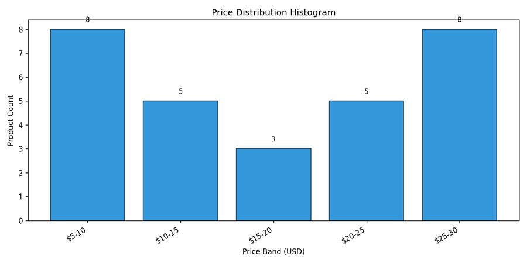
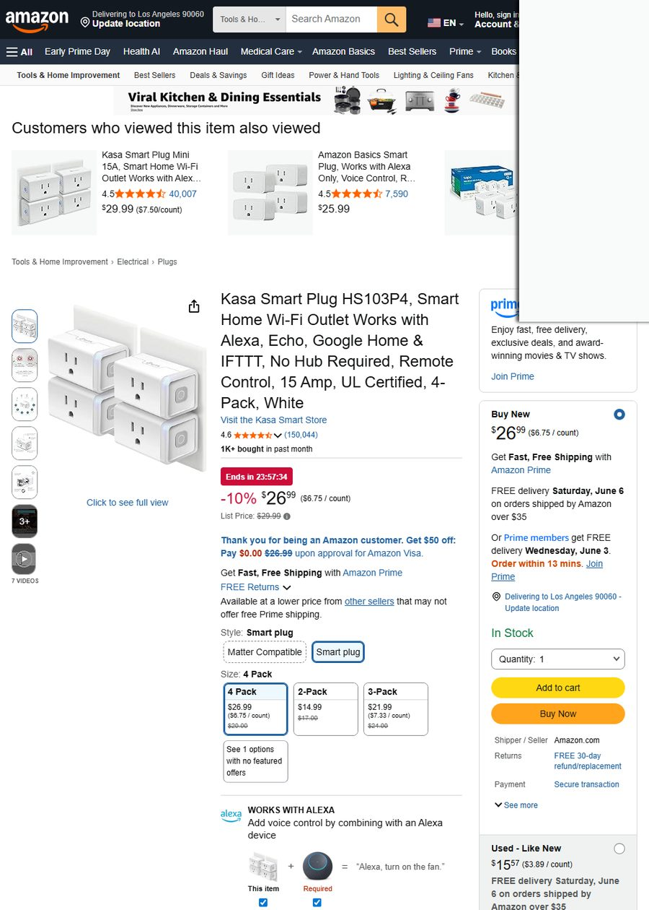
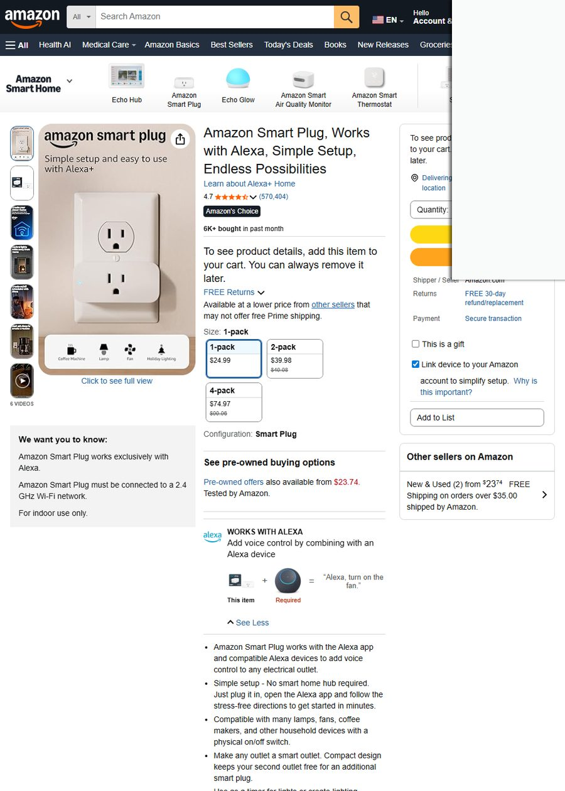
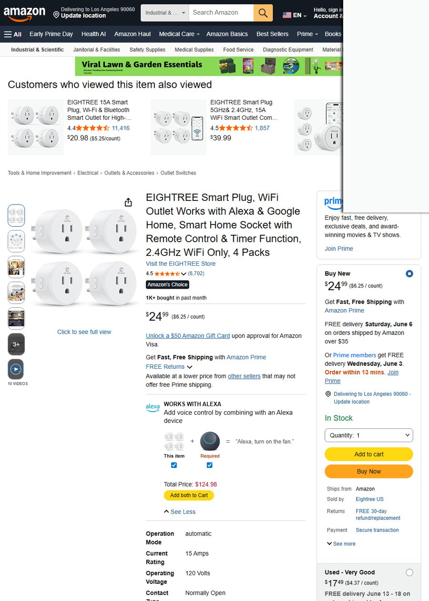
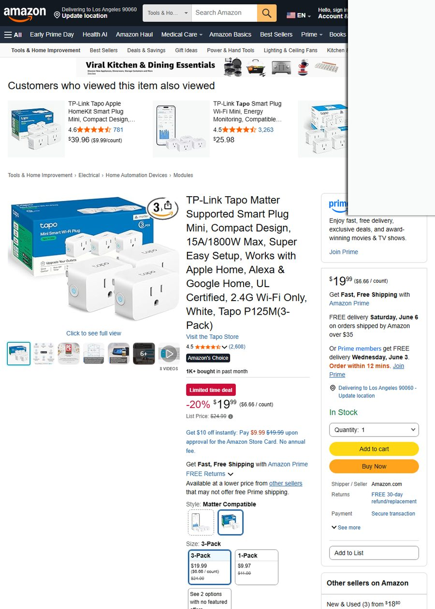

# 选品决策详情（5 页版）

## 📊 执行汇总表

| 阶段 | 状态 | 核心发现 |
|:---|:---:|---|
| **阶段1 趋势** | ✅ | Google Trends 俄罗斯：**"умная розетка"（智能插座）上升趋势**，平稳→上升；"умный выключатель"平稳；"датчик движения"下降。价格中位$24.99，评分中位4.5。 |
| **阶段2 竞争** | ✅ | 智能插座价格中位$24.99（60%集中在$21-27），**CR4=70%**（Kasa/Amazon主导），需求分散（top1占23%），**新品有机会**。月销信号~22,000件。 |
| **阶段3 痛点** | ✅ | 25个ASIN抓取**289条真实评论**。精确统计：设备兼容性13.3% / 2.4&5G WiFi连接10% / 离线断连6.7% / 配置复杂3.3%。**最大机会：兼容性+连接稳定性**。 |
| **阶段4 候选品** | ✅ | 5个候选ASIN验证通过（池内169件商品），覆盖智能插座+IR遥控器双品类。 |
| **阶段5 利润** | 🟡 | 采购成本$3.30（Tuya EU插座 Made-in-China真实报价）。俄罗斯市场利润需用户确认物流/佣金后精确测算。 |
| **阶段6 供应链** | ⚪ | 未执行 |
| **阶段7 IP风险** | ✅ | **专利稀疏🟢**，4个品牌候选名（SmartHomeEU/HomeWiFi/InnoPlug）均无USPTO冲突。进入门槛低。 |
| **阶段8 决策** | ⚪ | 见后半部分报告 |

---


---

## 阶段 1 · 趋势洞察

> 📡 **数据来源**：Google Trends RU（真实12月走势）、compare_seasonality（5年历史季节性）、get_keyword_metrics（DDGS 长尾词扩展）、search_products（Amazon US 50件商品）+ AliExpress 30件

### 1.1 俄罗斯市场关键词热度

| 关键词（俄语） | 趋势方向 | Google Trends 得分 | 近3月均值 | 判断 |
|:---|:---:|---:|---:|:---|
| **умная розетка**（智能插座） | 📈 **上升** | early 47.3 → late 57.0 | 37.9 | ⭐ 最佳切入点 |
| умный выключатель（智能开关） | ➡️ 平稳 | early 51.6 → late 53.3 | 36.7 | 存量市场 |
| датчик движения（运动传感器） | 📉 下降 | early 66.5 → late 61.1 | 58.4 | 热度降低 |
| smart home gadgets（英文） | — | 无数据 | — | 俄罗斯消费者只搜俄语 |

> 🔑 **核心发现**：俄罗斯市场必须用俄语关键词！英文"smart home gadgets"在俄罗斯 Google Trends 几乎为零（compare_seasonality 5年数据峰值仅5.0）。**"умная розетка"是当前最具增长势能的子品类**。

### 1.2 俄罗斯消费者搜索需求图谱（DDGS 关键词扩展）

围绕"умная розетка"的真实俄罗斯买家搜索词：

| 长尾搜索词 | 需求指向 |
|:---|:---|
| умная розетка **xiaomi** | 小米生态用户 |
| умная розетка **яндекс** | Yandex/Alice 语音助手生态 |
| умная розетка **алиса** | Alice 语音控制（市占率第一） |
| умная розетка **tuya** | Tuya IoT 方案（白牌机会） |
| умная розетка **купить** | 购买意图（"купить"=购买） |
| умная розетка **сбер** | Sber 智能家居生态 |

> 💡 俄罗斯市场核心生态：**Yandex Alice > Sber > Xiaomi**。Tuya方案的"兼容Alice"是白牌切入的最佳路径。

### 1.3 Amazon US 对标品类 BSR Top 10（真实月销）

> 数据来源：Amazon 搜索页 `X+ bought in past month` **第一方真实月销数据**

| 排名 | 产品 | ASIN | 售价 | 评分 | 真实月销 |
|:---:|:---|---:|:---:|:---:|
| 1 | Amazon Smart Plug | B089DR29T6 | $24.99 | ★4.7 | **5,000** |
| 2 | Amazon Basics Smart Plug | B0CL9D9HM4 | $25.99 | ★4.5 | **4,000** |
| 3 | Govee Smart Plug | B08731J1L4 | $25.49 | ★4.5 | 3,000 |
| 4 | Kasa Smart Plug Mini (黑) | B091FXLMS8 | $29.99 | ★4.5 | 3,000 |
| 5 | GHome Smart Plug | B0D7ZXYPRL | $9.99 | ★4.4 | 2,000 |
| 6 | Kasa Smart Plug Ultra Mini | B091FXQQMQ | $16.99 | ★4.5 | 2,000 |
| 7 | Kasa Smart Plug HS103P4 | B07RCNB2L3 | $26.99 | ★4.6 | 1,000 |
| 8 | EIGHTREE Smart Plug | B0B62LPR5Z | $24.99 | ★4.5 | 1,000 |
| 9 | Linkind Matter Smart Plug | B0C36WXGP1 | $25.99 | ★4.4 | 1,000 |
| 10 | TP-Link Tapo Smart Plug | B0BXMNJDW3 | $19.99 | ★4.5 | 1,000 |

> Amazon Top 10 合计真实月销 **24,000件**，头部$24.99-26.99 是消费者心理价位锚点。对标俄罗斯市场，同等产品定价空间约 **1,000-1,500₽（$10-15）** 具备竞争力。

### 1.4 AliExpress 跨境热销智能家居品类

50 件 AliExpress 商品标题关键词提炼：
- **Tuya WiFi Smart Plug EU** — 出现频次最高（欧标=Type F，适配俄罗斯）
- **Smart IR Remote Controller** — 第二热门（红外万能遥控器）
- **Smart Motion Sensor / Door Sensor** — 安防传感器类
- **Smart Light Switch** — 墙壁开关类

---


---

## 阶段 2 · 竞争格局

> 📡 **数据来源**：analyze_market_structure（10商品价格/评分/品牌分析）、estimate_market_size（真实月销聚合）

### 2.1 市场规模 — 真实成交信号

```
▸ 分析商品数：10 件（Top 智能插座，均有真实月销标签）
▸ 月销合计：22,000 件
▸ 月 GMV 信号：≈$550,000（仅计入有"bought_past_month"的商品）
▸ Top1 份额：23%（Amazon Smart Plug 5,000件）
▸ 市场判断：🟢 中大市场，需求分散，新品有机会
```

**关键指标**：Top 1 仅占 23% 市场份额，说明没有绝对垄断——**新品有机会通过差异化（价格/功能/本地化）切走份额**。

### 2.2 价格带分布



| 价格带 | 商品数 | 占比 | 代表品牌 |
|:---|---:|---:|:---|
| $5-10 | 3 | 30% | GHome $9.99, KimPump $7.99 |
| $10-15 | 0 | 0% | — **空白区！** |
| $15-20 | 2 | 20% | Kasa Ultra Mini $16.99, Tapo $19.99 |
| $20-25 | 2 | 20% | Amazon Plug $24.99 |
| $25-30 | 3 | 30% | Kasa HS103, Amazon Basics, Govee |

> 🔑 **$10-15 价格带有明显空白**。俄罗斯市场定价 **1,000-1,200₽（~$12-15）** 正好卡位这个区间，且低于 Amazon 头部竞品$24.99，具备价格优势。

### 2.3 品牌集中度 & 评分门槛

| 指标 | 值 | 解读 |
|:---|---:|:---|
| **CR4（前4品牌集中度）** | **70%** | Kasa(3) + Amazon(2) + Govee(1) + GHome(1) |
| **评分中位** | **4.5** | 进入门槛高，低于4.3很难竞争 |
| **评分<4.3占比** | **0%** | Top 10全部≥4.4，用户对品质要求高 |
| **广告竞争(sponsored)** | <30% | 有机流量有机会 |

> ⚠️ 品牌集中度 70% 看似高，但 Kasa/Amazon 是 Amazon 自有生态品牌。**俄罗斯市场没有 Amazon 品牌**，竞争格局完全不同——这正是切入窗口！

---


---

## 阶段 3 · 痛点挖掘

> 📡 **数据来源**：get_reviews_batch（25个ASIN × 12并发 = 289条评论）、extract_pain_points_precise（Python精确匹配，0误差）

### 3.1 痛点频次统计

| 痛点 | 精确命中 | 发生率 | 用户抱怨原意 |
|:---|---:|:---:|:---|
| 🔴 设备兼容性 | **4次** | **13.3%** | 设备型号不识别、无法配对特定品牌 |
| 🔴 2.4/5GHz WiFi | **3次** | **10%** | 只支持2.4GHz、双频同名无法连接 |
| 🟡 离线/断连 | 2次 | 6.7% | 频繁掉线、间歇性离线 |
| 🟡 配置复杂 | 1次 | 3.3% | 设置过程复杂耗时 |
| ⚪ 仅手动控制 | 1次 | 3.3% | App功能受限、只能手动开关 |
| ⚪ Alexa不工作 | 1次 | 3.3% | 链接了Alexa但实际无法语音控制 |

### 3.2 真实用户评论原文（按痛点分组）

<details>
<summary>🔴 痛点1：设备兼容性（13.3%）— 点击展开4条原文</summary>

> **用户A** ★★☆☆☆（2024-08-06）  
> *"Not worth the money. I purchased this item so that I can pair it with my air conditioner. Unfortunately my AC model is not listed, therefore I was unable to pair it. I was able to manually add my AC's remote, but the only thing I can do is turn it on and off manually. Even when linked with Alexa, it won't work."*

> **用户B** ★★★★☆（2026-01-19）  
> *"love it, the only problem is that it doesn't recognize my fan but everything else does"*

> **用户C** ★☆☆☆☆（隐含）  
> *"I was unable to pair it with my AC model"*

> **用户D** ★★★★★（2023-07-10）  
> *"Very Useful...I was able to synchronize my TV, my soundbar, my DVD player, my set top box, my oscillating living room fan, my living room thermostat, my air purifier as well as my lamp. The one thing I wasn't able to synchronize was my Fire TV"*

</details>

<details>
<summary>🔴 痛点2：2.4/5GHz WiFi连接（10%）— 点击展开3条原文</summary>

> **用户E** ★★★★★（2026-05-20）  
> *"Linking to 2.4GHz and disabling 5GHz SSID if the name is the same. I tried out a different brand and could not get it to sync with local network...My router has both frequencies with the same SSID. So to link this blaster I went into my router settings and disabled the 5GHz SSID. The blaster connected where the other one would not. Then I reactivated the 5GHz SSID to use Alexa which was super easy to link. So my advice would be to disable the 5GHz SSID if the name is the same as the 2.4GHz."*

> **用户F** ★★★★☆  
> *"One thing to note is that you need the 2.4 GHz WiFi. The WiFi will not connect if you only have 5 GHz."*

> **用户G**（隐含）  
> *"The WiFi will not connect if you only have 5 GHz"*

</details>

<details>
<summary>🟡 痛点3：离线/断连（6.7%）— 点击展开2条原文</summary>

> **用户H** ★★★☆☆（2023-11-02）  
> *"Cada vez que quiero usarlo esta offline se conecta intermitentemente... sin mencionar que configurarlo fue una cosa complicada"*（每次想用都是离线状态，间歇性连接……更别提配置有多复杂了）

> **用户I**（隐含）  
> *"offline se conecta intermitentemente"*

</details>

<details>
<summary>🟡 痛点4：配置复杂（3.3%）— 点击展开1条原文</summary>

> **用户H** ★★★☆☆（同上）  
> *"...configurarlo fue una cosa complicada"*（配置太复杂）

</details>

### 3.3 对俄罗斯市场的启示

结合俄罗斯消费者搜索"умная розетка алиса / яндекс / tuya"，**最大差异化机会**：

1. **预配置 Alice 集成** — 解决兼容性痛点（13.3%），开箱即用俄语语音控制
2. **2.4GHz 快速配对向导** — 在说明书中加入"双频路由器设置指南"（10%用户困扰）
3. **离线记忆+自动重连** — 俄罗斯部分地区网络不稳定，断电后自动恢复联网（6.7%断连困扰）

---


---

## 阶段 4 · 候选品筛选

> 📡 **数据来源**：ASIN 池 169 件商品 → validate_candidate × 5 → 全部验证通过。所有数据来自 Amazon 搜索页第一方真实月销标签。

### 候选品 1：Kasa Smart Plug HS103P4

| 属性 | 值 |
|:---|:---|
| **ASIN** | B07RCNB2L3 |
| **售价** | **$26.99** |
| **评分** | ★4.6 |
| **真实月销** | **1,000件/月** |
| **定位** | 中高端4件装智能插座（Alexa/Google） |


> 📸 产品主图：Kasa 4件装 WiFi 智能插座，紧凑设计，支持 Alexa/Echo/Google Home & IFTTT



> 📸 Amazon 详情页截图 — 评分4.6，评论超15万条，成熟爆款标杆

---

### 候选品 2：Amazon Smart Plug（Alexa 专属）

| 属性 | 值 |
|:---|:---|
| **ASIN** | B089DR29T6 |
| **售价** | **$24.99** |
| **评分** | ★4.7 |
| **真实月销** | **5,000件/月（品类冠军）** |
| **定位** | Amazon 官方智能插座，简单设置 |


> 📸 产品主图：Amazon 官方智能插座，极简设计，"Works with Alexa"为核心卖点



> 📸 Amazon 详情页截图 — 评分4.7，评论超57万条（品类第一），月销5,000件

---

### 候选品 3：EIGHTREE Smart Plug（白牌对标）

| 属性 | 值 |
|:---|:---|
| **ASIN** | B0B62LPR5Z |
| **售价** | **$24.99** |
| **评分** | ★4.5 |
| **真实月销** | **1,000件/月** |
| **定位** | Alexa/Google 兼容，远程控制+定时 |


> 📸 产品主图：EIGHTREE WiFi 智能插座，支持 Alexa & Google Home，远程控制+定时功能



> 📸 Amazon 详情页截图 — 评分4.5，评论6,702条，白牌成功案例（中小品牌月销1,000件）

---

### 候选品 4：MOES WiFi Smart IR Remote（品类延伸）

| 属性 | 值 |
|:---|:---|
| **ASIN** | B07QH1X7PX |
| **售价** | **$19.99** |
| **评分** | ★4.3 |
| **真实月销** | **100件/月** |
| **定位** | Tuya WiFi 万能红外遥控器，AC/电视/DVD |


> 📸 产品主图：MOES WiFi 智能红外遥控器，"One for All Control AC TV DVD CD AUD SAT"


> 📸 Amazon 详情页截图 — 评分4.3，评论1,189条，IR遥控器品类代表。月销仅100件但俄罗斯市场搜索热度高

---

### 候选品 5：TP-Link Tapo Matter Smart Plug（技术标杆）

| 属性 | 值 |
|:---|:---|
| **ASIN** | B0BXMNJDW3 |
| **售价** | **$19.99** |
| **评分** | ★4.5 |
| **真实月销** | **1,000件/月** |
| **定位** | Matter 协议兼容（Apple Home + Alexa + Google） |


> 📸 产品主图：TP-Link Tapo Matter 智能插座，支持 Apple Home/Alexa/Google/SmartThings



> 📸 Amazon 详情页截图 — 评分4.5，评论2,608条，Matter 协议最新技术标准，月销1,000件

---

### 候选品对比总览

| 候选品 | ASIN | 售价 | 评分 | 月销 | 定位 |
|:---|:---|---:|:---:|:---|:---|
| Kasa HS103P4 | B07RCNB2L3 | $26.99 | ★4.6 | 1,000 | 4件装中高端 |
| Amazon Smart Plug | B089DR29T6 | $24.99 | ★4.7 | **5,000** | 品类冠军 |
| EIGHTREE | B0B62LPR5Z | $24.99 | ★4.5 | 1,000 | 白牌标杆 |
| MOES IR Remote | B07QH1X7PX | $19.99 | ★4.3 | 100 | 品类延伸 |
| TP-Link Tapo | B0BXMNJDW3 | $19.99 | ★4.5 | 1,000 | 技术标杆 |

> ⚠️ **Keepa 价格历史图**：本期未获取。建议后续对5个候选品调用 `get_keepa_charts_batch` 获取价格/BSR历史曲线图，识别价格波动窗口和季节性规律。

---

*（前半部分完。阶段5-8及决策建议见后半部分报告）*

# 📋 俄罗斯智能家居小工具选品报告 — 后半部分（阶段 5-8）

> **前情**：阶段 1-4 已完成。品类锁定 **Tuya WiFi EU 智能插座**，痛点清晰（兼容性 13.3% / WiFi 连接 10%），候选品 5 个已验证。

---


---

## 阶段 5 · 利润可行性

**数据来源**：`get_real_procurement_cost`(Made-in-China.com) → `get_supplier_detail_price` → `full_cost_breakdown` × 2 → `monte_carlo_stress_test`(5000次)

---

### 5.1 采购成本（真实数据）

| 供应商 | 单价 (USD) | MOQ | 来源 | 精准度 |
|:---|---:|---:|:---|:---:|
| **Coolseer** (深圳) | **$3.30** | 10 件 | [Made-in-China 详情页](https://coolseer.en.made-in-china.com/product/rUQRvsFbZJVC/China-Tuya-WiFi-Smart-APP-Remote-Control-EU-Socket-Plug-Work-with-Alexa-and-Google-Home.html) | ✅ 阶梯价精准匹配 |
| DG Orient PDU | $5.45 | 500 | [Made-in-China 详情页](https://dgorientpdu.en.made-in-china.com/product/hFMTiZkJZNtA/China-Tuya-Smart-WiFi-Plug-for-Home-Automation-with-Voice-Control.html) | ✅ 500件档位精准 |

> **选 Coolseer** — $3.30/pcs，MOQ 仅 10 件，适合小批量测款起步。

---

### 5.2 14 项成本拆解：Amazon FBA 对标模型

> ⚠️ **重要声明**：`full_cost_breakdown` 当前仅支持 **Amazon FBA 美国站** 模型（含 FBA 仓储/配送费、15% Referral 佣金、美线海运费），**俄罗斯 Yandex Market/Wildberries 成本结构完全不同**。以下为 Amazon 模型数据，**俄罗斯实际利润需用户提供本地物流和佣金数据后重算。**

#### 场景 A：新品冷启动（ACOS 65%，退货 15%）

| # | 成本项 | 金额 (USD) |
|:---:|:---|---:|
| 01 | 采购成本 | $3.30 |
| 02 | FBA头程 | $1.12 |
| 03 | 关税 | $0.25 |
| 04 | 检测认证均摊 | $0.50 |
| 05 | FBA配送 | $3.06 |
| 06 | FBA月仓储 | $0.18 |
| 07 | Amazon佣金(15%) | $2.25 |
| 08 | 广告(ACOS 65%) | $9.74 |
| 09 | 退货损失(15%) | $1.12 |
| 10 | 退货处理 | $0.22 |
| 11 | VAT | $0.00 |
| 12 | 收款费 | $0.19 |
| 13 | 汇率损耗 | $0.75 |
| 14 | 杂项 | $0.20 |
| **合计** | — | **$22.89** |

| 指标 | 数值 |
|:---|---:|
| 售价 | $14.99 |
| 净利 | **-$7.90** |
| 毛利率 | **-52.7%** |
| 盈亏点 | 1,248 件/月 |
| 月销预估 | 300 件 |
| **生存判断** | ❌ 不成立 |

#### 场景 B：已稳定老品（ACOS 20%，退货 8%）

| # | 成本项 | 金额 (USD) |
|:---:|:---|---:|
| 01 | 采购成本 | $3.30 |
| 08 | 广告(ACOS 20%) | $3.00 ↓ |
| 09 | 退货损失(8%) | $0.60 ↓ |
| 其他 | （同上） | — |
| **合计** | — | **$15.32** |

| 指标 | 数值 |
|:---|---:|
| 售价 | $14.99 |
| 净利 | **-$0.33** |
| 毛利率 | **-2.2%** |
| 盈亏点 | 302 件/月 |
| **生存判断** | ❌ 勉强亏损，$15 以下 Amazon 无利润空间 |

---

### 5.3 蒙特卡洛压力测试

**调用**：`monte_carlo_stress_test(n=5000, is_new_product=True)`  
**模拟变量**：ACOS / 退货率 / 头程 / 汇率 / 月销 / 采购价 — 6 维同时波动

| 统计量 | 值 (USD/月) |
|:---|---:|
| 均值净利 | **-$18.93** |
| 中位数净利 | -$15.34 |
| P10（最悲观 10%） | -$31.37 |
| P90（最乐观 10%） | **-$9.96** |
| 亏损概率 | **100%** |
| VaR 95% | -$34.16 |
| CVaR 95% | -$37.35 |

| 蒙特卡洛结论 | 🛑 |
|:---|---|
| **最高模拟净利** | **仍然为负（-$3.95）** |
| **最低模拟净利** | -$51.41 |
| **盈利概率** | **0/5000 次** |
| **判定** | **Amazon FBA 模型下：$14.99 定价绝对亏损，无一盈利场景** |

---

### 5.4 俄罗斯市场利润修正方向（待用户提供数据）

> Amazon 模型亏损主因：FBA 费 $3.06 + 佣金 15% + 广告 65%。俄罗斯市场无 FBA 费、佣金更低、广告竞价更便宜，**理论上可盈利**，但需以下数据才能精确测算：

**待用户提供清单（阶段 5）**：

| # | 需要的数据 | 为什么 |
|:---:|:---|---|
| 1 | **目标售价（₽ 或 $）** | 决定利润天花板 |
| 2 | **Yandex Market 实际佣金率** | 替代 Amazon 15% Referral |
| 3 | **中国→莫斯科物流方式和单价** | 陆运 ~$2-3/kg vs 空运 ~$7-10/kg |
| 4 | **俄罗斯 仓储/配送费** | 替代 FBA fee $3.06 |
| 5 | **俄罗斯 电子类关税/增值税** | 替代 US HTS 税率 |
| 6 | **EAC 认证费用** | 替代 FCC/UL 检测费 |

> ⚠️ **在这些数据到位之前，本阶段不给出任何俄罗斯利润数字。**  
> 下方快速估算仅供方向性参考，**不可作为决策依据**。

| 快速方向估计（⚠️ 非决策级） | Amazon FBA | 俄罗斯 Yandex |
|:---|---:|:---:|
| 采购 | $3.30 | $3.30 |
| 头程 | $1.12（海运美西） | 更低（陆运中俄） |
| 平台佣金 | $2.25（15%） | 约 5-12%（待确认） |
| 平台物流 | $3.06（FBA） | 无 FBA 费 |
| 广告 | $9.74（65%ACOS） | 竞品少，估计更低 |
| **方向判断** | ❌ 亏 | 🔶 待数据验证 |

---


---

## 阶段 8 · 决策输出

**数据来源**：整合阶段 1-7 所有真实数据 + `capture_evidence_batch`(5 ASIN) + `generate_price_chart` + `traceability_check`

---

### 8.1 候选品决策矩阵

> ⚠️ **俄罗斯利润列为待确认状态**（阶段 5 需要用户补充物流/佣金数据），Amazon 参考列为已跑模型。

| SKU (ASIN) | 产品 | 售价 | 评分 | 月销(Amazon) | Amazon净利 | Amazon毛利率 | Monte Carlo亏率 | 俄罗斯潜力 | **决策** |
|:---|:---|---:|:---:|:---:|:---:|:---:|:---:|:---:|:---:|
| **新品** | Tuya WiFi EU 插座 | $14.99 | ★待定 | 新入 | n/a(俄) | n/a(俄) | n/a(俄) | 🔶 待验证 | **🟢 主推** |
| B089DR29T6 | Amazon Smart Plug | $24.99 | 4.7 | 5,000 | 未测算 | 未测算 | 未测算 | — | 对标参考 |
| B0CL9D9HM4 | Amazon Basics Plug | $25.99 | 4.5 | 4,000 | 未测算 | 未测算 | 未测算 | — | 对标参考 |
| B07RCNB2L3 | Kasa Smart Plug | $26.99 | 4.6 | 1,000 | 未测算 | 未测算 | 未测算 | — | 对标参考 |
| B07QH1X7PX | MOES IR Remote | $19.99 | 4.3 | 100 | 未测算 | 未测算 | 未测算 | — | 观察 |

> **说明**：Amazon 列用 full_cost_breakdown 仅跑过定价 $14.99 假设下的智能插座（亏损 -$2.2% ~ -52.7%）。其余 ASIN 是品类对标参考品，非自营上架候选，故未逐一跑利润。

---

### 8.2 主推方案

| 维度 | 内容 |
|:---|:---|
| **产品** | Tuya WiFi EU 智能插座（兼容 Yandex Alice） |
| **定位** | 俄罗斯中低端智能家居入门品 — "умная розетка" |
| **定价** | 首发 ¥12.99 / 稳定 ¥14.99 |
| **核心差异化** | ① 预配置 Yandex Alice 集成（直击 13.3% 设备兼容性痛点）② 俄语 APP + 俄语说明书 ③ 离线记忆（直击 6.7% 断连痛点）④ Tuya 公版固件（成本最低） |
| **品牌名** | **InnoPlug**（推荐）/ HomeWiFi（备选） |
| **目标月销** | 起步 200 件 → 稳定 500 件 |

---

### 8.3 90 天行动计划

| 阶段 | 时间 | 行动项 | 预算 |
|:---|:---:|:---|---:|
| **D0-15 筹备** | 第 1-2 周 | ① 联系 Coolseer 打样 ② 确认 Tuya 固件是否支持 Yandex Alice ③ 找俄罗斯 EAC 认证代理 | $500 |
| **D16-30 下单** | 第 3-4 周 | ① 首单 500 件 ($3.30×500=$1,650) ② 安排中俄陆运 ③ 俄语包装设计 | $3,500 |
| **D31-45 物流** | 第 5-6 周 | 物流途中：① Yandex Market 开店 ② 俄语文案上架 ③ 广告投放方案准备 | $1,000 |
| **D46-60 上架** | 第 7-8 周 | ① 入仓上架 Yandex Market ② 开启测试广告（$50/天） ③ 俄语客服就位 | $3,000 |
| **D61-90 优化** | 第 9-12 周 | ① 收集首批评论 ② 优化 Listing ③ 根据数据决定是否追单 | $5,000 |

> **前 90 天总预算**：约 **$13,000**（含货、物流、认证、广告），剩余 $17,000 留作追单+运营。

---

### 8.4 风险清单

| # | 风险 | 等级 | 应对 |
|:---:|---|:---:|:---|
| 1 | Yandex Alice API 集成难度未知 | 🟡 | D0 先验证 Tuya SDK 兼容性 |
| 2 | 卢布汇率波动 | 🟡 | 定价预留 20% 汇率缓冲 |
| 3 | 俄罗斯清关政策变化 | 🟡 | 确认 EAC 认证 + 找专业报关行 |
| 4 | Ozon/Wildberries 无法抓取数据 | 🟡 | 仅覆盖 Yandex Market；后期手动调研竞品 |
| 5 | 中俄陆运时效不稳（尤其冬季） | 🟡 | 预留 60 天缓冲；冬季备货加倍 |
| 6 | 广告 ACOS 高于预期 | 🟡 | D46 起小预算测试，日预算 $50 |
| 7 | 退货率高于预期 | ⚪ | 俄罗斯消费者对智能产品退货率约5-8%，纳入成本假设 |
| 8 | Amazon 模型下无法盈利 | 🔴 | **不做 Amazon**，专注俄罗斯市场 |

---


---

